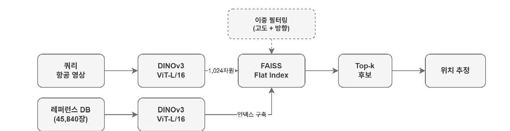
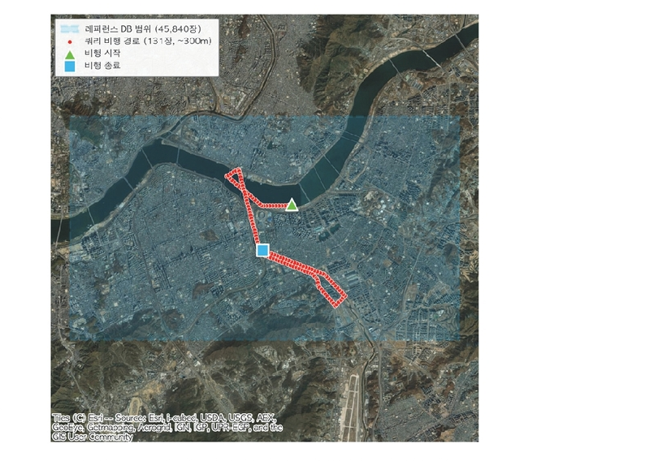
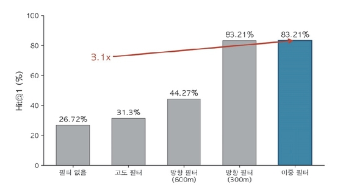

# Aerial VPR Search — DINOv3 + FAISS

[](docs/paper_KSGIS2026.pdf)
[](docs/paper_KSGIS2026.pdf)
[](csharp)
[](python)

Search/matching code accompanying the paper below. Given a query aerial image and
its altitude/heading, this repo retrieves the most visually similar images from a
pre-built reference gallery using a DINOv3 feature embedding and a FAISS index —
a visual place recognition (VPR) approach to localization when GNSS is denied.

> Hyuneun Seo, Insung Jang, **"Aerial Image Retrieval and Matching System for UAM
> Localization in GNSS-Denied Environments,"** Proceedings of the KSGIS (Korean
> Society for Geospatial Information Science) 2026 Spring Conference, pp. 171-174.
> [[PDF]](docs/paper_KSGIS2026.pdf)

## Abstract

Urban Air Mobility (UAM) needs a fallback localization method for the GNSS signal
loss that tall buildings cause in dense urban airspace. This work combines a
DINOv3 Vision Transformer with FAISS vector indexing, and applies a dual
metadata filter (altitude + heading, from onboard IMU/barometer/magnetometer)
to narrow the search space before matching. Applying dual filtering improves
Hit@1 accuracy from 26.72% to 83.21% — a 3.1x gain — and a 600 m-altitude
reference DB (9,168 images) with dual filtering matches the accuracy of a 300 m
DB four times larger (36,672 images), without any manual tuning.

## Pipeline



1. **Feature extraction** — DINOv3 ViT-L/16 (Meta AI, self-supervised), CLS token
   as a 1024-dim global descriptor. No labels needed.
2. **Vector search** — FAISS `Flat` index (exhaustive, exact nearest neighbor)
   returns the top-k most similar reference images.
3. **Dual filtering** — before the FAISS search, the candidate pool is narrowed
   to reference images whose recorded altitude and heading are close to the
   query's (from flight metadata, not GNSS).

## Dataset (not included)

Experiments were run over aerial imagery of the Jamsil area, Seoul: 131 query
images (altitude 290-300 m) against two reference DBs — 300 m (36,672 images,
8 headings) and 600 m (9,168 images, 8 headings), each image tagged with
altitude/heading metadata.



**The flight imagery, reference gallery, and metadata are not provided in this
repo.** Bring your own dataset in the same JSON schema (see below) to reproduce
the experiments.

## Results

| Strategy | Hit@1 (%) | Hit@10 (%) |
|---|---|---|
| No filter | 26.72 | 72.52 |
| Altitude filter | 31.30 | 83.21 |
| Heading filter (600m) | 44.27 | 85.50 |
| Heading filter (300m) | 83.21 | 98.47 |
| **Dual filter** | **83.21** | **98.47** |



## What's here / what isn't

**Included:** the search-time half of the pipeline — feature extraction
(inference only), FAISS index loading/search, and Hit@1/Hit@5 evaluation
against ground-truth (Haversine) distance.

**Not included:**
- The index-build code (gallery images → DINOv3 features → FAISS index)
- Training data, flight imagery, JSON metadata
- The DINOv3 ONNX weights (`model.onnx`)
- The FAISS native library (`faiss_c.dll` / `libfaiss_c.so`)
- Pre-built `.index` / `.txt` index files

Two implementations are provided:

| | `csharp/` | `python/` |
|---|---|---|
| Platform | .NET 9, Windows | Windows / Linux / Jetson |
| Modes | `check`, `search` | interactive experiment runner |
| Filtering | single index only (no filter) | all 4 strategies from Table 1 (`select_engines_for_query`) |

## Repository structure

```
docs/
  paper_KSGIS2026.pdf     # the paper this code accompanies
  figures/                # figures extracted from the paper, used above

csharp/                   # .NET 9, Windows, ONNX Runtime GPU
  Program.cs              # check / search modes only (no build)
  FeatureExtractor.cs     # single-image DINOv3 inference (CLS, 1024-dim)
  FaissNative.cs          # FAISS C API subset: load / search / set params
  VprSearch.csproj / .sln

python/                   # Windows / Linux / Jetson
  main.py                 # experiment runner: reproduces Table 1
  models/
    dino_extractor.py     # DINOv3 ONNX inference (CUDA/CPU auto-select)
    faiss_index.py         # FAISS load/search (C-API on Jetson, Python bindings elsewhere)
  requirements.txt
```

## What you need to bring

1. **Model** — DINOv3 ViT-L/16 exported to ONNX, normalized with SAT-493M stats
   (mean `[0.430, 0.411, 0.296]`, std `[0.213, 0.156, 0.143]`). Uses the CLS
   token (1024-dim).
2. **Index** — a FAISS `Flat` index built from the same model over your
   reference gallery (`.index`), plus a filename list matching the index order
   (`.txt`).
3. **Native library** — `faiss_c.dll` next to the C# executable. On the Python
   side, `libs/faiss_c.dll` (Windows) or `/app/libs/libfaiss_c.so` (Jetson) if
   you want the C-API path; otherwise `pip install faiss-gpu` / `faiss-cpu`.
4. **Metadata JSON** (`--ref-json`, `--query-json`, or a JSON next to the query
   folder for Python):

```json
{
  "images": [
    {
      "imageref": "filename.jpg",
      "position": { "latitude": 0.0, "longitude": 0.0, "altitude": 300.0 },
      "attitude": { "yaw": 0.0 }
    }
  ]
}
```

## Usage

### C#

```powershell
dotnet build -c Release
dotnet run -c Release -- check
dotnet run -c Release -- search `
    --query "TestData\query" `
    --query-json "TestData\query\query_labels.json" `
    --ref-json "dino_temp\ref_master.json" `
    --index "dino_temp\600_Flat.index"
```

### Python

```bash
pip install -r requirements.txt   # plus faiss-gpu or faiss-cpu for your setup
python main.py
# choose experiment 1-14 at the prompt; 10-14 reproduce Table 1's spatial filters
```

Populate `database/ref/` with your `.index`/`.txt` (and, for split search,
`Flat_<altitude>_<heading>.index`), `test_images/` with query images + JSON,
and `model/model.onnx` with your model.

## Metric

Hit@1 / Hit@k: the fraction of queries where the FAISS top-1 (or top-k) result
is within the ground-truth top-5 by physical (Haversine) distance. Results are
written as CSV under `result/` (C#) or `output/` (Python).

## Citation

```
Hyuneun Seo, Insung Jang, "Aerial Image Retrieval and Matching System for
UAM Localization in GNSS-Denied Environments," Proceedings of the KSGIS
2026 Spring Conference, pp. 171-174, 2026.
```

## Acknowledgement

This work was supported by ETRI (Electronics and Telecommunications Research
Institute), funded by the Korean government, under the Industrial Convergence
Intelligence Research program (No. 26ZR1110).
